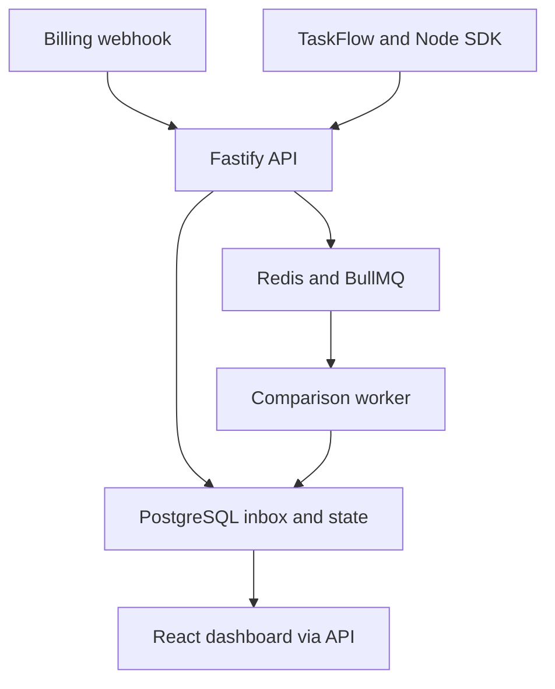

# Architecture

The expected entitlement comes from the plan catalog and a customer subscription. The observed entitlement comes from a server side application decision. A deterministic comparison produces either a match or an incident.

## Execution boundary

The API authenticates callers and stores an observation before enqueueing its identifier. The worker reads the durable record, locks the customer's state for the transaction, checks whether it was already processed or superseded, and updates incident evidence and the processed marker together. A five second recovery loop attempts to enqueue older unprocessed records. This narrows the database to queue handoff failure window; it is not a distributed transaction or a claim of exactly once delivery.

Customer updates and comparisons use PostgreSQL transaction advisory locks. Locks also serialize subscription changes. Native PostgreSQL lock contention and parallel failure scenarios still require validation.

## State transitions

A discrepancy creates an OPEN incident. Later discrepant observations increment its count and add occurrence records. A matching fresh observation resolves OPEN or ACKNOWLEDGED incidents. Manual acknowledgement, resolution and ignoring are available in the dashboard. Ignoring an incident does not modify application access or prevent future mismatches from opening another incident.

## Webhook processing

The API verifies the signature against raw request bytes and records the provider event. Duplicate event identifiers with the same payload are acknowledged. Conflicting payloads are rejected. The worker normalizes the supported Stripe subscription event into the internal plan catalog using `metadata.entitlementci_plan_key`. Provider timestamps older than or equal to the current timestamp are ignored. Equal second events need an explicit tie breaker or authoritative provider fetch before stronger ordering guarantees can be made.

## Tenant boundary

Each human request resolves a session and organization membership. Project, customer, plan and key operations check organization ownership. SDK keys bind organization, project and environment. The database has shared tables with scoped foreign keys and application checks; PostgreSQL row level security is not enabled. The UI uses one active organization, with project filtering. Organization switching via UI is not implemented.

## Hosted reviewer

The Vercel deployment bundles React and the pure comparison package. Its sample state stays in browser memory and resets on reload. It does not call the full backend. The local application and the hosted reviewer are deliberately labelled in their interfaces.
