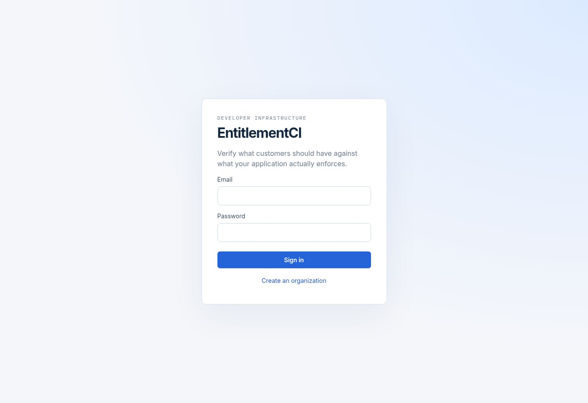

# Live backend deployment

Verified on 8 October 2026.

Application: https://api-production-48225.up.railway.app/

Application commit: `f7670c3c456b6036046b32a42f6d8bc997f63db8`.

GitHub [CI run #4](https://github.com/chaitanyalogin/entitlementci/actions/runs/37747462000) passed build, migrations, type checks, lint, ten unit/security tests, the dependency audit, eighteen integration checks and the Playwright browser flow. Railway built and started the actual Node Docker images for that commit. Both database migrations applied successfully.

| Component                       | Deployment                             | Verification                                                                                                      |
| ------------------------------- | -------------------------------------- | ----------------------------------------------------------------------------------------------------------------- |
| React dashboard and Fastify API | Public HTTPS origin, Node 24 container | Login page rendered in browser; dashboard and deep links return HTML; `/ready` returns database and Redis success |
| BullMQ worker                   | Separate continuous Node container     | Healthy replica; actual observations produced and resolved incidents                                              |
| PostgreSQL 18                   | Private service with persistent volume | Both migrations applied; live account, catalog, incident and session data verified                                |
| Redis 8.2                       | Private service with persistent volume | Queue processing verified through the live worker                                                                 |

Neither PostgreSQL nor Redis has a public TCP proxy. Only the dashboard/API has a public domain. `NODE_ENV=production` enables Secure cookies, and application secrets are generated independently of the local sandbox. The API serves the dashboard itself so cookies and CSRF stay on one origin.

The services are pinned to the tested application commit. A later GitHub push does not automatically replace them. Deploy a new tested commit explicitly through Railway before changing the live version.

## Live verification

[`evidence/cloud-smoke.json`](evidence/cloud-smoke.json) records twelve passing checks against the deployed service: readiness, dashboard/deep links, registration with Secure/HttpOnly cookies, sign in, catalog and scoped key creation, actual worker mismatch detection, incident grouping, automatic resolution after correction, tenant isolation, CSRF and disabled demo controls, key revocation, and server session invalidation.

The test created two isolated synthetic organizations. Their passwords were discarded, their SDK key revoked and their sessions ended. They contain no real customer data. This test uses actual HTTP routes, the deployed database and the deployed worker; it does not use browser sample state.

## First use

Open the application and click **Create an organization**. Choose your email, organization name and a password with at least twelve characters. Local demo credentials do not exist in the hosted database. Create features, plans, a project and customers, then use a scoped API key to send observed access through the Node SDK.

TaskFlow and Drift Lab controls remain in the local sandbox. They are disabled in this hosted environment. The public reviewer demo remains available for the sample failure/fix/regression walkthrough.

## Limits

Railway's trial offers limited credits rather than permanent free hosting. Monitor usage and arrange durable backups before relying on this instance beyond the trial. No paid upgrade was performed by this deployment.

This is a working portfolio backend deployment, not a claim that commercial operational readiness is complete. Load/soak tests, dedicated concurrency and queue outage recovery tests, live Stripe delivery, backup restore and rollback exercises remain pending. Production email delivery is not implemented. The worker's notification state update is not proof of email delivery.
